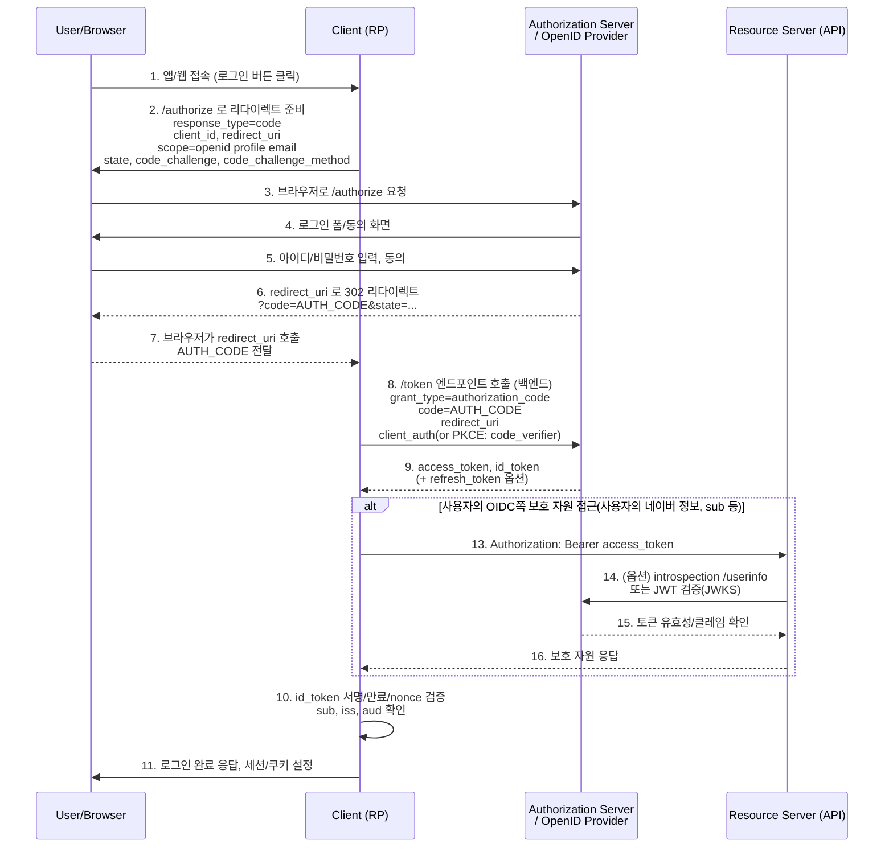
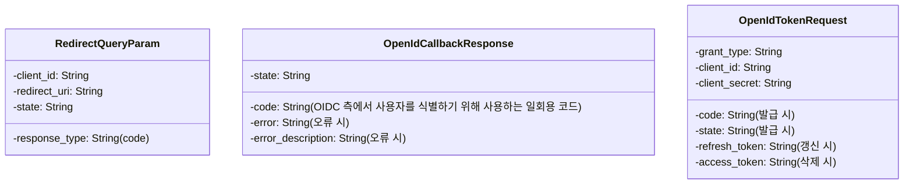
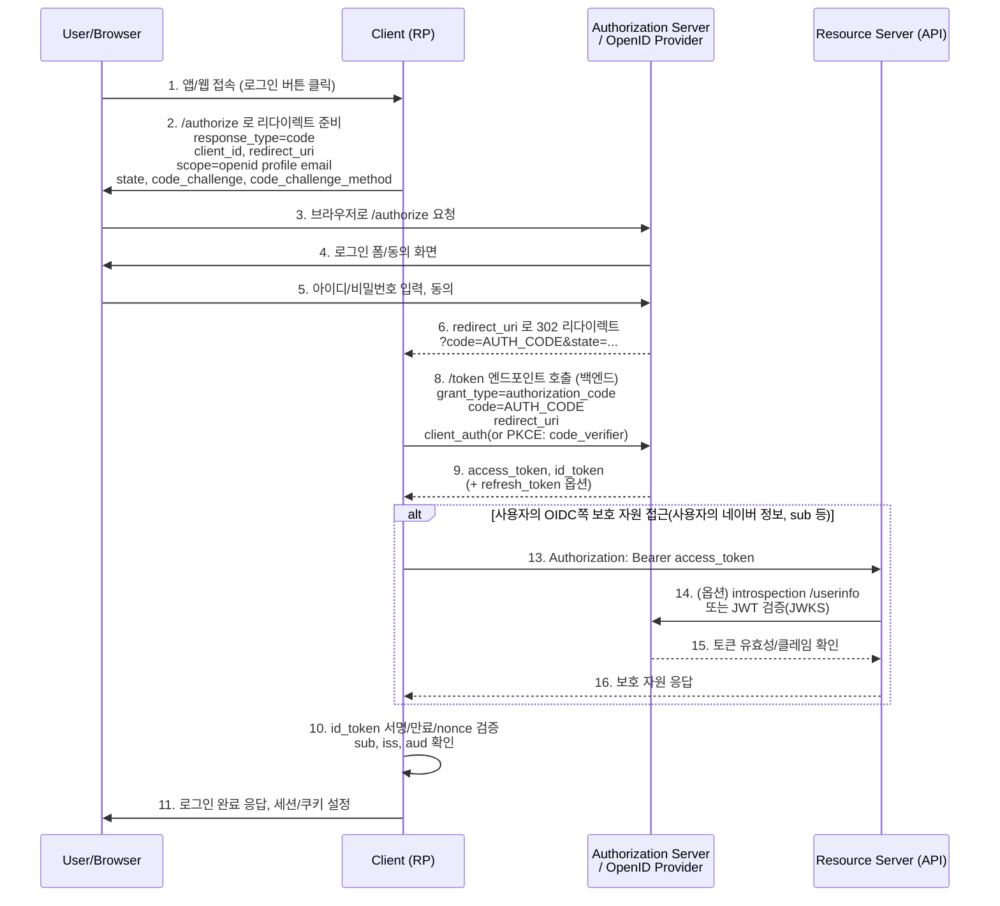

# JWT 기반 OIDC 로그인/인증 구현 계획

첫 MSA 도입, 한번에 다 만들려고 하면 복잡하다.

각각 독립적인 기술인 만큼, JWT + OIDC 조합 두 단계로 나눠서 접근하자.

> **목차**
> 1. 내 JWT 인증 흐름 먼저 만들기
> 2. 그다음 OIDC 로그인 붙여서 “로그인 수단”만 확장하기
> 3. 회원가입 이벤트 발행 + be 서버에 공개 키 공유해서 인증 연동하기
---

## 0. 큰 그림 결정하기

1. **아키텍처 결정**
    * `pinit-auth` = 인증/토큰 발급 서버
    * `pinit-be` = 일정/통계 리소스 서버
    * FE(프론트)는 **항상 내 서버 JWT**를 들고 `pinit-be`를 호출
    * 외부(OIDC: 구글/네이버/카카오)는 “사용자 신원 확인 수단”으로만 쓰고,
      내 서버가 그걸 받아 **자체 access/refresh JWT를 발급**하는 구조로 사용한다.

2. **토큰 정책**
    * Access Token: 짧게 (5분~10분)
    * Refresh Token: 길게 (2주)
    * 서명: HS256(대칭 키) vs RS256(공개키/비밀키)
        * HS256이 간단. RS256은 키 관리가 번거로움.
        * 비밀 키를 auth 서버에만 두고, 공개키로 be 서버에서 검증하는 것이 안전함.
    * 로그아웃은 구현하지 않는다.
        * 필요에 따라 프론트에서 Access Token/Refresh Token 삭제 처리
        * 서버에서 Refresh Token 블랙리스트 관리도 가능하지만, 복잡도 증가 (글로벌 세션 스토리지 필요, 무상태성 훼손)
        * 따라서 당장은 구현하지 않음.
    * refresh 토큰 재발급 정책:
        * refresh 토큰으로 access 토큰 재발급 시, refresh 토큰도 함께 재발급
            * refresh 토큰 만료 기간을 새로 갱신하여 로그아웃 되지 않은 상태로 유지
        * refresh 토큰 만료 시, 다시 로그인 필요
3. **전달 방식**
    * Access Token: `Authorization: Bearer ...`
    * Refresh Token: HttpOnly 쿠키
    * `*.pinit.go-gradually.me`  상위 도메인 전략 사용.

---

## 1. 순수 JWT 로그인/인증부터 완성하기

### (1) Auth 도메인/테이블 정리

* `Member`
    * id (PK)
    * 테스트용으로 email, password (BCrypt 해시) 필드 추가
    * 닉네임은 be api에 쿼리 파라미터 or body로 전달
* `OauthAccount`
    * 나중 OIDC용
    * (iss, sub, memberId) 따로 두면 좋을듯

> 참고: OIDC는 식별자 발급자 (iss) + 피식별자(sub) 조합으로 유니크한 사용자를 구분한다.
> 이는 변경 가능성이 있는 이메일과 달리 안정적 식별자 역할을 한다.

ID 토큰이 sub을 의미하는 듯 하다.

아이디 토큰은 integer로 주어진다.


그런데 OIDC 공식 문서에 따르면 sub는 string이다.
https://openid.net/specs/openid-connect-core-1_0.html#IDToken

따라서 sub은 string으로 설계한다.

(이후 OIDC 로그인 붙일 때 제대로 설계할 것)

그리하여 Authentication 의 설계는 다음과 같다.

```java
public class JwtAuthenticationToken extends AbstractAuthenticationToken {
    private final Long memberId;
    private final String token;

    public JwtAuthenticationToken(String token) {
        super(Collections.emptyList());
        this.memberId = null;
        this.token = token;
        super.setAuthenticated(false);
    }

    public JwtAuthenticationToken(Long principal, String token, Collection<? extends GrantedAuthority> authorities) {
        super(authorities);
        this.memberId = principal;
        this.token = token;
        super.setAuthenticated(true);
    }

    @Override
    public String getCredentials() {
        return token;
    }

    @Override
    public Long getPrincipal() {
        return memberId;
    }

    @Override
    public void setAuthenticated(boolean isAuthenticated) {
        if (isAuthenticated) {
            throw new IllegalArgumentException("인증 상태 설정은 생성자에서만 할 수 있습니다.");
        }
        super.setAuthenticated(false);
    }
}
```

### (2) JWT 발급/검증 유틸 만들기

스프링 시큐리티 아키텍처의 형식은?

>
출처: [내 블로그](https://dev.go-gradually.me/entry/%EC%8A%A4%ED%94%84%EB%A7%81-%EC%8B%9C%ED%81%90%EB%A6%AC%ED%8B%B0-%EC%9D%B8%EC%A6%9D-%EC%95%84%ED%82%A4%ED%85%8D%EC%B2%98)


* Filter: 인증/인가 처리 진입점
* AuthenticationManager
    * Spring Security의 필터가 인증을 수행하는 방법을 정의하는 API
    * 이는 인증 프로세스의 핵심 인터페이스로, Authentication 객체를 입력으로 받아 인증을 수행합
* Authentication - 두 가지 주요 목적으로 사용됨
    1. AuthenticationManager에 입력으로 제공되어 사용자가 인증을 위해 제공한 자격 증명의 목적
    2. SecurityContext에서 현재 인증된 사용자를 나타내는 목적

    * 이 객체는 주체, 자격 증명, 권한 등의 정보를 포함한다.
* AuthenticationProvider
    * ProviderManager에 의해 사용되어 특정 유형의 인증을 수행한다.
    * 예를 들어, 사용자 이름/비밀번호 기반 인증, LDAP 인증, OAuth 인증 등 다양한 인증 방식을 구현할 수 있다.

즉, provider에서 UserDetailsService로 사용자 조회하고, PasswordEncoder로 비밀번호 검증한다.

* `JwtTokenProvider` 같은 컴포넌트
    * `String createAccessToken(memberId, roles, ...)`
    * `String createRefreshToken(memberId, ...)`
    * `Claims parse(String token)`
    * 유효성 검증/만료 체크 등

signwith 메서드에 Deprecated 된 알고리즘들이 보인다.


암호화 알고리즘의 확장성을 지원하기 위해, jjwt 0.12.0부터는 `SecureDigestAlgorithm`인터페이스를 도입했다.

SecureDigestAlgorithm

이와 같이 쓰면 된다고 하니, 잘 써보자.

### (3) JWT 필터 구현

* `JwtAuthenticationFilter` (OncePerRequestFilter 구현)
    * `doFilterInternal(HttpServletRequest req, HttpServletResponse res, FilterChain chain)`
    * `Authorization` 헤더에서 `Bearer xxx` 토큰 추출
    * JwtAuthenticationManager로 인증 시도
    * JwtAuthenticationToken 만들어서 SecurityContext에 set

### (4) 테스트용 로그인 API (ID/PW) + 토큰 발급

1. `/auth/login` (POST)
    * email, password 받기
    * `UserDetailsService` 또는 직접 레포지토리로 사용자 조회
    * 비밀번호 매칭 (BCryptPasswordEncoder)
    * 성공 시 access/refresh JWT 발급
    * 응답:
        * JSON body에 accessToken 넣고,
        * refreshToken은 HttpOnly 쿠키로 내려주는 패턴으로

2. `/auth/refresh`
    * refreshToken 쿠키(or 헤더) 검증
    * 유효하면 새 accessToken 발급

3. `/auth/logout`
    * 클라이언트 쿠키 삭제 + (옵션) 서버에서 refresh blacklist 처리

### (4) 스프링 시큐리티 필터/설정

be 로직의 필터에 들어가야 하는 로직
JWT를 검증해서 `SecurityContext`에 인증 정보 넣는 필터 구현

* `OncePerRequestFilter` 구현해서:
    * `Authorization: Bearer xxx` 추출
    * 유효한 토큰이면 `UsernamePasswordAuthenticationToken` 만들어 `SecurityContext`에 set
* `SecurityFilterChain` 설정:
    * `/auth/**`, `/oauth2/**` 등은 `permitAll`
    * 나머지는 `authenticated()`
    * Session은 `STATELESS`

---

## 2. OIDC (외부 로그인) 붙이기

### (0) OIDC의 이해

* User-Browser
    * 사용자가 브라우저에서 앱에 접속
* Client (RP, Relying Party)
    * 내 애플리케이션 (pinit-auth)
    * 사용자를 대신해 인증 요청을 보낸다.
* Authorization Server / OpenID Provider (OP)
    * 구글, 네이버, 카카오 등
    * 사용자 인증 및 ID 토큰 발급
* Resource Server (RS)
    * 보호된 API 서버
    * 액세스 토큰으로 보호 자원 제공

OIDC 의 흐름을 살펴보면 다음과 같다.

> 공식 용어가 아닌, 백엔드 개발자 관점에서 이해하기 쉽게 풀어쓴 것이다.
> 원래는 "백엔드 서버"의 경우 OIDC에서는 OIDC 입장에서 "Client" 또는 "Relying Party (RP)"라고 부른다.

1. 사용자가 앱/웹에 접속하여 로그인 버튼 클릭
2. 백엔드 서버가 사용자를 OpenID Provider의 `/authorize` 엔드포인트로 리다이렉트시킬 준비한다.
    * `response_type=code`
    * `client_id`, `redirect_uri`
    * `scope=openid profile email`
    * `state`, `code_challenge`, `code_challenge_method` (PKCE)
    * 이때, 서버는 사용자 세션에 `state`와 `code_verifier`를 저장해둔다. (즉, 이때의 상태를 저장해둘 수 있어야 한다.)
3. 사용자의 브라우저가 OpenID Provider의 `/authorize` 엔드포인트로 요청을 보낸다.
4. OpenID Provider가 사용자에게 로그인 폼과 동의 화면을 제공한다.
5. 사용자가 아이디/비밀번호를 입력하고 동의한다.
6. OpenID Provider가 사용자를 우리 백엔드의 `redirect_uri`로 302 리다이렉트한다.
    * 쿼리 파라미터로 `code=AUTH_CODE`와 `state=...`를 포함한다.
7. 백엔드 서버가 OpenID Provider의 `/token` 엔드포인트로 백채널 요청을 보낸다.
    * `grant_type=authorization_code`
    * `code=AUTH_CODE`
    * `redirect_uri`
    * `client_auth` (또는 PKCE의 경우 `code_verifier`)
8. OpenID Provider가 백엔드 서버에 `access_token`, `id_token` (및 옵션으로 `refresh_token`)을 응답한다.
9. 백엔드 서버가 `id_token`의 서명, 만료, nonce 등을 검증한다.
    * `sub`, `iss`, `aud` 등을 확인한다.
10. 백엔드 서버가 로그인을 완료하고, 우리의 로그인 처리를 수행한다.
    * 지금의 경우, 앞서 구현한 JWT 발급 로직을 재사용하여 자체 access/refresh 토큰을 발급한다.

만약 사용자의 Openid Provider 쪽 보호 자원(예: 사용자의 네이버 정보 등)에 접근해야 한다면

1. 백엔드 서버가 Resource Server에 요청을 보낸다.
    * 앞서 OP 쪽에게서 발급받은 Access Token을 이용하여 `Authorization: Bearer access_token` 헤더를 포함하여 요청한다.
2. Resource Server가 (옵션으로) OpenID Provider에 토큰의 유효성을 확인한다.
    * introspection 엔드포인트 또는 userinfo 엔드포인트를 호출하거나,
    * JWT인 경우 JWKS를 이용해 서명 검증을 수행할 수 있다.
3. Resource Server가 보호 자원을 응답한다.

이를 시퀀스 다이어그램으로 표현하면 다음과 같다.



여기서 필요한 상태를 추출하면 다음과 같다. (명사 추출법/네이버 개발자 문서 참고)



OIDC 쪽에서 제공하는 출력 값은 다음과 같다.

* OpenID Provider가 사용자를 우리 백엔드의 `redirect_uri`로 302 리다이렉트할 때
    * API 요청 성공 시: http://콜백URL/redirect?code={AUTH_CODE}&state={...}
    * API 요청 실패 시: http://콜백URL/redirect?state={...}&error={ERROR_CODE}&error_description={DESCRIPTION}
* access token 발급 요청 시
    * access_token: String
    * token_type: string (예: Bearer)
    * expires_in: integer (초 단위)
    * error: string (오류 시)
    * error_description: string (오류 시)

다른 주요한 형식은 해당 OIDC 제공자 문서를 참고한다.
> 현재 이 글의 경우, [네이버 OIDC 문서](https://developers.naver.com/docs/login/api/api.md)를 참고하고 있다.


이제 OIDC를 통해 제공받을 수 있는 회원 정보(클레임)를 정리해보자.

```json
{
  "resultcode": "00",
  "message": "success",
  "response": {
    "email": "openapi@naver.com",
    "nickname": "OpenAPI",
    "profile_image": "https://ssl.pstatic.net/static/pwe/address/nodata_33x33.gif",
    "age": "40-49",
    "gender": "F",
    "id": "32742776",
    "name": "오픈 API",
    "birthday": "10-01",
    "birthyear": "1900",
    "mobile": "010-0000-0000"
  }
}
```

우리는 이제 여기서 "id" (sub 역할)만 있으면 회원 매핑이 가능하다.

### (1) OIDC 도메인 설계

- [x] 네이버 로그인 인증 요청 도메인 추가 (백엔드가 세팅 후 프론트 네이버로 리다이렉트시킴) - NaverLoginSetting
- [x] 접근 토큰 발급 요청 도메인/DTO 추가 - OpenIdTokenRequest, OpenIdPublishCommand
- [x] 접근 토큰 갱신 요청 도메인/DTO 추가 - OpenIdTokenRequest, OpenIdRefreshCommand
- [x] 접근 토큰 삭제 요청 도메인/DTO 추가 - OpenIdTokenRequest, OpenIdRevokeCommand
- [x] 네이버 로그인 요청 출력 결과 도메인 추가(리다이렉트) - NaverLoginResult
- [x] 접근 토큰 발급 요청의 출력 결과 도메인 추가 - OpenIdTokenResponse, OpenIdPublishResponse
- [x] 접근 토큰 갱신 요청의 출력 결과 도메인 추가 - OpenIdTokenResponse, OpenIdRefreshResponse
- [x] 접근 토큰 삭제 요청의 출력 결과 도메인 추가 - OpenIdTokenResponse, OpenIdRevokeResponse
- [ ] 에러 코드 Enum 추가
- [x] 사용자 프로필 조회 요청 도메인 추가 - 없음. 헤더에 엑세스 토큰 넣어서 호출
- [x] 사용자 프로필 조회 요청의 출력 결과 도메인 추가 - NaverUserProfileResponse

### (2) 사용자 매핑 도메인 설계

* `OauthAccount` 테이블 예:

    * id
    * provider (`GOOGLE`, `NAVER`, `KAKAO` …)
    * providerUserId (`sub`, `id` 등)
    * memberId (내부 Member FK)
* 로그인 성공 시:

    1. (provider, providerUserId)로 `OauthAccount` 조회
    2. 있으면 → 해당 member 사용
    3. 없으면 → 새 Member 생성 → `OauthAccount`도 함께 생성 (트랜잭션)
* 이렇게 하면:

    * 한 member가 여러 provider를 연결하는 것도 가능해짐.

### (3) API 호출 설계

#### 문제 1: 메소드의 형태

- 발급 -> 토큰 두개 반환
- 갱신 -> 토큰 하나 반환
- 삭제 -> 토큰 없음

이걸 하나의 getToken 메소드로 통합하려니 문제가 생기는 중이다.

행위 자체가 다른데 하나의 메소드로 묶이는 게 맞나?

API 명세가 하나로 합쳐져 있을 뿐, 행위 자체는 다르다.

#### 해결 방법

1. 세 개의 메소드로 분리
2. 하나의 메소드로 합치되, 실제 행위는 커맨드 패턴으로 분리

OIDC 설계 방식은 2번에 가까운 듯 하다.
하지만 반환 값이 다르니, 이를 적절히 반환할 방법이 없다.

1. 인터페이스인 Oauth2Provider에서 List<Oauth2Token> 을 리턴 값으로 정의한다고 해도, NaverOP에서는 List<NaverOauth2Token>를 반환해야 한다.
    - 제네릭은 기본적으로 불공변성이다.
        - 따라서 List<NaverOauth2Token> 는 List<Oauth2Token> 의 하위 타입이 아니다.

2. 그러면 Oauth2Provider 에서 List<? extends Oauth2Token> 와일드카드 기법을 사용하면 된다.
    - 와일드카드 기법을 사용하면, List<NaverOauth2Token> 는 List<? extends Oauth2Token> 의 하위 타입이 된다.
    - 따라서 Oauth2Provider 인터페이스를 구현할 수 있다.

3. 하지만 JWT의 형식 자체는 이미 고정되어 있다.
    - 굳이 NaverOauth2Token 같은 구체적인 토큰 클래스를 만들 필요가 없다.
    - 따라서 List<Oauth2Token> 하나로 통일하는 게 낫다.

#### 문제 2: 토큰 객체로의 변환 방식

- Command
    - 각 명령에 맞는 데이터 보관
- Provider
    - 해당 OIDC 제공자의 API 호출
    - 해당 OIDC와 관련된 정보 보관.
    - Command 객체를 받아서 처리
    - 결과를 Token 객체로 반환

커맨드 패턴으로 행위를 구분하더라도, 결국 API 호출은 Provider가 담당해야 한다.

- 이때 API 호출에 필요한 데이터가 결국 Provider에서 풀려야 한다.

- 이 API 호출에 필요한 형식은 결국 해당 Provider에 종속적이므로, Provider에서 Command 객체를 푸는 형태로 구현이 되어야 함.

그런데 이러면 Command 객체가 execute 메소드를 가질 이유가 없다.

- 커맨드 패턴으로 할 이유가 없어진다. (이미 외부(OP)에서 인풋에 대한 execute 메소드 형식을 가지고 있다.)

- 결과를 token 객체로 반환하는 걸 Command가 해야 하는 거 아닌가? -> jackson이 해야지 이건.

- 주어진 응답을 적절한 token 객체들로 매핑

#### 해결 방법

토큰 객체의 형식을 결정하는 건 OIDC가 아닌 우리 서비스이다.

- Command
    - 각 명령에 맞는 데이터 보관
    - 토큰 객체의 형식 지정
        - 결과를 Token 객체들로 반환
- Oauth2Service
    - 해당 OIDC와 관련된 정보 보관.
- Provider
    - 해당 OIDC 제공자의 API 호출

### (4) Oauth2Provider, Service 구현


!!!!
내부 프록시 호출 시 발생할 수 있는 트랜잭션 이슈가 이제 보인다!

구현을 하던 도중, 외부 API와 통신을 해야하는 Provider들이 명료하게 보이지 않는 것이 아쉬웠다.

어떻게 하면 Provider들을 현재 모듈의 주요한 컴포넌트로 인식시킬 수 있을까?

#### 문제 1: @Provider 어노테이션 붙이기

```java

@Component
@Target(ElementType.TYPE)
@Retention(RetentionPolicy.RUNTIME)
public @interface Provider {
    String value() default "";
}
```

이제 좀 더 욕심이 나기 시작했다.

굳이 각 Provider 별 서비스를 만드는 것보단, Oauth2Service를 정의해두면 Mapper를 이용해 전략 패턴으로 처리할 수 있을 것 같다는 생각이 들었다.

그렇다면 어떻게 이를 맵에 등록할까?

1. ApplicationContext에서 빈들을 다 꺼내서, @Provider 붙은 것들만 골라내기
2. @ComponentScan + @Provider 어노테이션 조합으로 직접 컴포넌트 스캔하기

3. 굳이 컴포넌트 스캔을 다시 구현하는 것보단, 1번을 활용하면 스프링 빈들을 탐색해주는 Mapper 객체를 사용할 수 있다.


이러면 스프링 빈 등록이 잘 되나? 라는 생각이 들 수 있는데,

ListableBeanFactory 는 Bean Definition 을 가지고 있는데,

스프링 빈 인스턴스 생성 방식은 getBean이 호출 되는순간 해당 인스턴스를 먼저 생성하는 방식을 재귀적으로 적용하기 때문에 문제는 없다.


즉, "빈 정의" 계층과 "빈 생성" 계층이 나뉘어져 있기 때문에 빈 정보를 가지고 내 내부 필드를 채울 수 있는 것이다.

(스프링 DI 의 원리를 살짝 응용해 사용한 것에 가깝다.)

#### 문제 2: grant가 없다는 문제

이제 본격적으로 OIDC 호출을 구현하고 테스트하는데, grant_type이 없다는 오류가 발생했다.

로그를 찍어봐도 grant 값이 OpenIdTokenRequest 에 잘 들어가 있었기에 정말 원인을 알 수가 없었다.


요청과 응답 포맷을 봐도 원인을 알 수가 없었다...

정말 많은 시간을 소모했는데, 도저히 뭐가 잘못된건지 이해가 안가서 주어진 예제를 한번 더 살펴봤다.


나는 습관적으로 application/json으로 보내고 있었다.
이는 객체 전송 시 json 방식이 편하다고 생각했고, 주어진 출력 포맷도 json으로 응답을 받기에 그렇게 생각했다.

하지만 실제 예제는 x-www-form-urlencoded 방식이었고, 혹시나 하는 마음에 urlencoded 방식으로 바꿔보니 grant_type이 정상적으로 전달되었다.

아마 OIDC 표쥰이 x-www-form-urlencoded 방식을 요구하는 듯 하다.


---

## 3. 리소스 서버(pinit-be) 인증 연동

### (1) 성공 핸들러에서 내 JWT 발급

그렇게 백엔드에서 OIDC 로그인이 성공하면, 이제 내 JWT를 발급해야 한다.

하지만 문제가 하나 있었다. OIDC로부터 액세스 토큰을 받았지만, 이상하게 백엔드에서 필터에 걸려 프로필 정보를 확인할 수 없었다.

현재 나의 시스템 시퀀스 다이어그램은 다음과 같았다.




처음 생각은 다음과 같았다.

1. OIDC의 redirect_uri 를 백엔드 API 로 지정해야 한다.
2. 사용자는 백엔드 API로 리다이렉트해서, 받은 응답을 그대로 GET 요청으로 OIDC 제공자에게 전달한다.
3. OIDC 제공자는 Access Token 을 응답받고, 백엔드는 이를 통해 사용자 정보를 조회한 뒤 내 JWT를 발급한다.

하지만 이건 잘못된 생각이었다.

1. OIDC의 redirect_uri 를 백엔드 API 로 지정해야 한다.
2. 사용자는 백엔드 API로 리다이렉트해서, 받은 응답을 그대로 GET 요청으로 OIDC 제공자에게 전달한다.
    - 이 부분이 잘못되었다. 사용자가 백엔드 API로 리다이렉트되는 순간, 사용자는 더이상 FE를 거치지 못한다.
    - 따라서 FE로 내 JWT를 전달할 수 없다.


따라서 프론트에 별도의 콜백 엔드포인트를 만들어, OIDC 제공자의 redirect_uri로 지정했다.

그러자 정상적으로 Oauth2 로그인이 완료되었고, 프론트에서 내 JWT를 받을 수 있었다.
