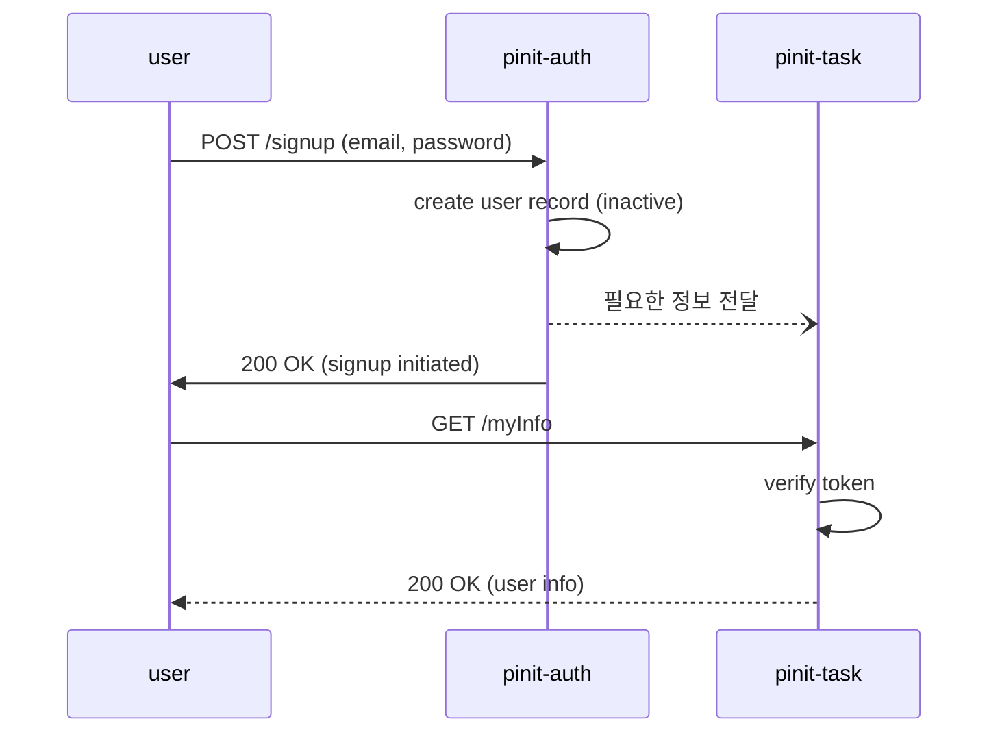
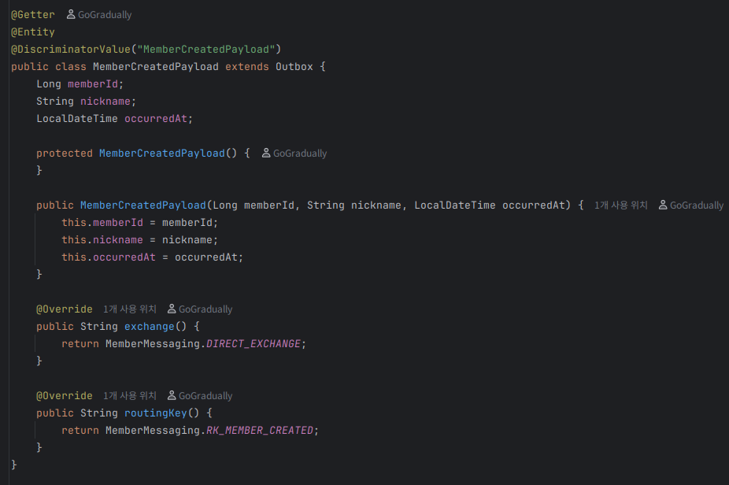
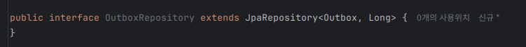
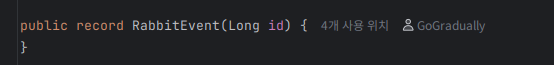
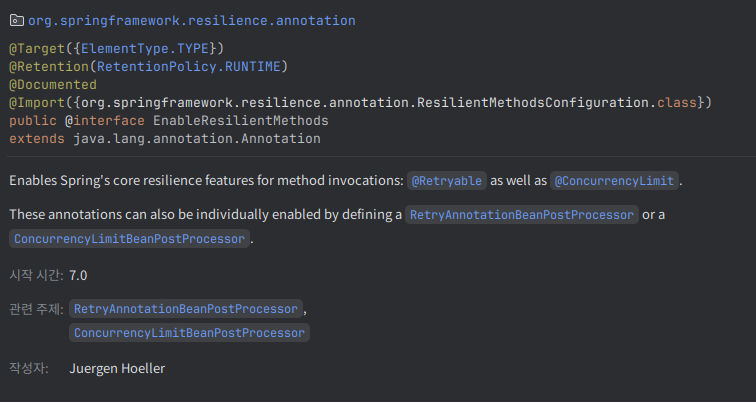

## 회원가입 플로우, 이대로 괜찮은가? - 정합성 문제 해결 방안

### 현재 구조

### 문제 상황

사용자가 이벤트가 도착하기 전 / 도착한 후의 처리 분류

이미 로그인 성공은 확정이라고 가정

로그인 성공 - 도착한 후

- task 서버에서 사용자 정보를 정상 처리
    - 정상 플로우

로그인 성공 - 도착하기 전

- task 서버에서 auth 서버에서 처리한 사용자 정보를 아직 못받음
- 일정을 생성할 수 없음(예외 발생)
    - 사용자의 지역 정보를 받아와야 하는데, user record 자체가 없음
- 별명도 존재하지 않음

task, auth 서버 간의 문제다.
별명 정보는 필수가 아님.
진짜 문제는 일정 생성이다.

id값을 위조한 JWT 토큰은 만들 수 없다. (회원 탈퇴 후 기존 JWT를 사용하는 경우는 고려하지 않음)
따라서, 해당 일정 조회는 해당 id가 있다고 가정하고 수행하는 것이 옳다.

#### 선택지 1: task에서 ‘자동 프로비저닝’(Read-through / Lazy create)

- task가 일정 조회 요청을 받았는데 user가 없으면
    - auth(또는 user profile 서비스)로부터 최소정보를 조회하여 즉시 user를 생성 후 진행
- 장점: UX/핵심 기능 보호, 이벤트 누락에도 복원 가능
- 단점: task가 auth에 의존(런타임 결합)

#### 선택지 2: 최종 일관성 유지 + 명확한 “준비중” 응답과 재시도

- user가 없으면 404/500 대신 503 Service unavailable / 도메인 에러코드(USER_NOT_READY) 같은 형태로 반환
    - 클라이언트 또는 BFF가 짧은 재시도(backoff) 후 재호출
- 장점: 의존성 최소화, 상태가 명시적
- 단점: UX에 재시도 로직 필요, 최종 일관성이 반드시 보장되어야 한다는 전제 필요
    - 트랜잭션 아웃박스 패턴 설계 필요

gRPC를 이용한 추가적 런타임 의존성 결합보단, 최종 일관성 유지 + 명확한 준비중 응답이 더 나아 보인다.

실제로 자주 발생하지는 않을 예외이다. 이벤트 처리가 그렇게까지 느려진다면, 계산복잡도적 문제가 아닌 인프라 자체가 지나치게 안좋은 문제에 가깝다.

1. DB에 해당 이벤트 저장
2. After_commit 후 비동기 트랜잭션 새로 열어서 해당 이벤트 발행 후 삭제

- 이때, AFTER_COMMIT 이기 때문에 새 트랜잭션은 커밋된 해당 이벤트를 볼 수 있다.(READ_COMMITTED 격리 수준)
- 이벤트 발행 성공 후 트랜잭션이 롤백되면, 한번 더 발행하면 된다. (수신 측의 중복 처리는 idempotent 하게 설계하면 가능하다)
    - 지수적 백오프 재시도

3. task 서버는 이벤트 수신 후 사용자 정보 업데이트

---

### 로직 변경 방안

현재 코드에서는 도메인 이벤트 퍼블리셔로 RabbitDomainEventPublisher가 사용되고 있었다.

실제 이벤트 발행은 다음과 같았다.

#### 현재 로직

1. 회원가입 트랜잭션 커밋
2. 이벤트 발행
3. AFTER_COMMIT 후 비동기 트랜잭션에서 이벤트 발행

이제 이를 위에 설계한 형식대로 변경해야 한다.

#### 변경할 로직

1. 회원가입 트랜잭션 내에서 도메인 이벤트 기록 (즉, 더이상 AFTER_COMMIT이 아님, 비동기적으로 동작하지도 않음)
2. 이벤트 기록 후, 이벤트 발행을 시도하는 비동기 AFTER_COMMIT 메소드 호출 -> 애플리케이션 이벤트 발행.
3. 해당 애플리케이션 이벤트 리스너에서 발행해야 하는 이벤트의 ID를 받아서, 도메인 이벤트 발행 시도

#### 기본 Event Publisher 변경

1. 도메인 이벤트 퍼블리셔의 변경
   

도메인 이벤트 퍼블리셔를 이제 스프링 애플리케이션 이벤트 퍼블리셔를 사용하도록 변경했다.

2. 이벤트 메시지를 저장하는 리포지토리 추가.

이 이벤트를 기록하는 리포지토리는 DB 테이블 `Outbox` 를 사용했다.

해당 Outbox 테이블은 다형적 쿼리를 지원하기 위해 JPA의 Single Table 전략을 사용했다.

이렇게 하면, 모든 Payload 타입이 이 outbox 테이블을 상속받음으로써, 단일 테이블에 저장된다.

이제 이 본문을 저장할 repository를 추가했다.

#### 도메인 이벤트를 애플리케이션 이벤트(Outbox)로 변환

다음과 같이 Outbox 테이블을 관리할 서비스를 추가했다.

이때의 Outbox 객체는 싱글 테이블 전략을 사용하기 때문에

- JPA 레벨에서 실제 객체 타입을 정해주고,
- 다형성을 지원한다.

이제 도메인 이벤트를 애플리케이션 이벤트로 변환하는 퍼블리셔를 작성했다.

- @EventListener 어노테이션을 사용하여, 도메인 이벤트가 발생했을 때 Outbox 레코드를 생성한다.
    - 이때, 트랜잭션 컨텍스트 내에서 동작하기 위해 @Async 와 @TransactionalEventListener 없이 사용되었다.
    - 도메인 이벤트가 발생한 트랜잭션이 커밋되기 전까지는 Outbox 레코드가 생성되지 않는다.

그리고 outboxService.save()는 해당 Outbox 레코드를 저장한 뒤, RabbitMQ 발행을 시도하는 비동기 AFTER_COMMIT 이벤트를 발행한다.

---

### 지수적 백오프의 사용

스프링 프레임워크 7부터는 @Retryable이 기본 기능으로 제공된다.

`@EnableResilienceMethods` 어노테이션을 설정하면, @Retryable을 사용할 수 있다.

그리하여 다음과 같이 AFTER_COMMIT 메소드에서 아웃박스에 저장되어있는 이벤트 발행을 트리거하고,

다음과 같이 @Retryable 어노테이션을 사용하여, 지수적 백오프 재시도를 구현했다.
